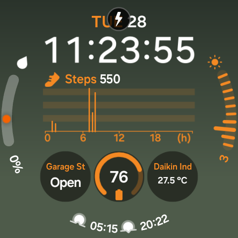

# Watch Face Complications

Display openHAB item values directly on your watch face — temperature, switch state, energy readings, door status — without opening the app.



## How It Works

The app registers complication data sources that the watch face system pulls data from. You select "openHAB Item" from the watch face complication picker, choose which item to display, and the value appears on the watch face.

Supported complication types:
- **SHORT_TEXT** — compact value with label (e.g., "22.5 °C" with title "Temp")
- **LONG_TEXT** — full label and value (e.g., "Daikin Indoor: 28.5 °C")
- **RANGED_VALUE** — arc/progress indicator for numeric values (dimmers, temperatures)
- **MONOCHROMATIC_IMAGE** — icon that changes based on item state (active/inactive)

## Configuring Items for Complications

Items are configured for complications via the **Phone Companion App**, which writes a `wear:complication-list` document to the server.

### Phone Companion App

The phone companion's **Complications** section manages which items appear in the watch's complication picker:

1. Open the phone companion → **Complications**
2. Tap "+" to add an item from the server's item list
3. Configure display options per complication type:
   - **SHORT_TEXT** — title (7 chars max), value pattern (e.g., `"%.0f°C"`)
   - **LONG_TEXT** — title, value pattern
   - **RANGED_VALUE** — title, value pattern, min/max overrides
   - **MONOCHROMATIC_IMAGE** — icon, active/inactive icon variants
4. Save — writes a `wear:complication-list` document to the server at `{namespace}/complications`
5. The watch reads this document when the user opens the complication picker

The editor uses the **Config Server** connection (local openHAB with write access) to persist the document. The watch reads it via the **Main Server** connection.

### Server Document Structure

The `wear:complication-list` document stored at `/rest/ui/components/{namespace}/complications`:

```json
{
  "uid": "complications",
  "component": "wear:complication-list",
  "slots": {
    "default": [
      {
        "component": "wear:complication-slot",
        "config": {
          "slotNumber": 1,
          "item": "Temp_Outside",
          "label": "Outside",
          "icon": "temperature",
          "supportedTypes": ["SHORT_TEXT", "RANGED_VALUE"],
          "shortText": { "title": "Out", "text": "%.0f°C" },
          "rangedValue": { "min": -20, "max": 50 }
        }
      }
    ]
  }
}
```

### Legacy fallback

If no `wear:complication-list` document exists, the watch falls back to discovering items with `wearTile` metadata where `value = "complication"` or `config.complication = "true"`. This is a migration path only — new setups should use the phone companion app exclusively.

## Adding a Complication to Your Watch Face

1. Long-press the watch face → **Customize** or **Edit**
2. Tap a complication slot
3. Scroll to find **openHAB Item**
4. Select it — `ComplicationConfigActivity` opens showing items from the phone-configured `wear:complication-list`
5. Pick the item you want to display
6. The value appears on the watch face, refreshing every 5 minutes

Prerequisites: the phone companion must have at least one item configured in the Complications section and saved to the server.

## Tap Behavior — Control Activities

Tapping a complication routes to the appropriate **control activity** based on item type:

| Item Type | Activity | Behavior |
|-----------|----------|----------|
| Switch, Group | ToggleControlActivity | Toggle button + On/Off display |
| Dimmer, Number with range | RotaryControlActivity | Bezel-driven value adjustment |
| Color | ColorPickerActivity | Color presets + brightness bezel |
| Rollershutter | RollerShutterActivity | UP/STOP/DOWN buttons + position bezel |
| Items with commandOptions | ChoicePickerActivity | Scrollable option list |
| Other (read-only) | ComplicationDetailActivity | Shows current value |

All control activities share consistent styling via `ControlScreenComponents.kt`:
- **Logo** — 32dp wearOH branding icon
- **Label** — 14sp, single line, from item's server label
- **Value** — 32sp bold, highlighted in the user's selected theme color
- **SSE updates** — real-time state changes while the activity is visible
- **Complication refresh** — complications update immediately after sending a command

### Label Resolution

Labels are resolved in priority order:
1. `item.label` from the REST API (human-readable label configured in openHAB)
2. `config.label` from the complication document (if not equal to item type)
3. `item.name` (technical item identifier, last resort)

Labels matching the item type string (e.g., "Switch", "Dimmer") are filtered out.

## Update Frequency

- Complications refresh every **5 minutes** (system-managed via `UPDATE_PERIOD_SECONDS`)
- A background WorkManager job triggers additional updates every 15 minutes
- Tapping a complication always fetches a fresh value
- After sending a command from a control activity, complications refresh immediately via `ComplicationRefresher`
- The system may reduce update frequency in ambient mode or when off-wrist

## Value Formatting

The complication displays values using this priority:

1. **transformedState** — server-formatted value (e.g., stateDescription pattern `[%.1f %unit%]` → "28.5 °C")
2. **Options lookup** — `stateDescription.options` or `commandDescription.commandOptions` label (e.g., "boost" → "Boost", "CLOSED" → "Closed")
3. **Built-in labels** — ON→"On", OFF→"Off", OPEN→"Open", CLOSED→"Closed"
4. **Pattern formatting** — per-type config pattern (e.g., `"%.0f°C"`)
5. **Numeric auto-formatting** — value with unit symbol based on item type
6. **Raw state** — truncated to 12 characters (last resort)

## Theme Color

All control activities and the tile use the user-selected theme color (Amber, Blue, Green, Purple, Red). The theme is:
- Selected in the phone companion's **Tile Design** editor
- Stored in the server's main tile page `config.theme` field
- Read by the watch during cold load and persisted to local `ThemeStore`
- Applied to: value text highlighting, progress arcs, button backgrounds, active option indicators

## Architecture

### Complication Architecture

The app registers a single complication data source (`OpenHabComplicationService`). When the user adds it to a watch face slot, `ComplicationConfigActivity` opens and shows the items configured in the phone companion's `wear:complication-list` document. The user picks one, and the slot→item mapping is stored locally in `ComplicationPreferenceStore`.

```
Watch face picker → "openHAB Item"
  → ComplicationConfigActivity (item picker from server config)
  → User picks item → saved to ComplicationPreferenceStore
  → OpenHabComplicationService.onComplicationRequest()
    → reads item from preference store
    → fetches state from REST API
    → returns ComplicationData
```

On tap:
```
User taps complication → ComplicationTapActivity
  → reads item from ComplicationPreferenceStore
  → fetches item from server (type, state, commandDescription)
  → routes to appropriate control activity
```

### Complication Refresh Flow

```
User changes value in control activity
  → repository.sendCommand(itemName, command)
  → ComplicationRefresher.requestUpdate()
    → OpenHabComplicationService.requestUpdateAll()
    → OpenHabSlotComplicationService.requestUpdateAll(context)
      → System calls onComplicationRequest() for each active slot
        → repository.getItem(itemName) — fresh fetch
        → formatValue(item, pattern) — with options lookup
        → Returns updated ComplicationData to watch face
```

### SSE Real-Time Updates

Control activities subscribe to Server-Sent Events for the specific item while visible:

```
Activity visible
  → repository.observeItemState(itemName)
    → Connects SSE to /rest/events?topics=openhab/items/{item}/statechanged
    → Emits new state values as Flow<String>
    → Activity updates UI in real-time
Activity dismissed
  → Flow collector cancelled
  → SSE connection closed (battery-safe)
```

### Key Components

| File | Purpose |
|------|---------|
| `OpenHabComplicationService.kt` | Complication data source — responds to system update requests |
| `ComplicationTapActivity.kt` | Routes tap to appropriate control activity based on item type |
| `ComplicationConfigActivity.kt` | Item picker shown when adding the complication (shows server-configured items) |
| `ComplicationPreferenceStore.kt` | Stores complication slot → item name mapping in DataStore |
| `ComplicationRefresher.kt` | Triggers refresh after commands are sent from control activities |
| `ComplicationUpdateWorker.kt` | Periodic WorkManager refresh (15 min) |
| `ControlScreenComponents.kt` | Shared UI: logo, label, value, theme constants |
| `ToggleControlActivity.kt` | Switch/toggle control with SSE |
| `RotaryControlActivity.kt` | Bezel-driven dimmer/range control with SSE |
| `ColorPickerActivity.kt` | Color preset grid + brightness bezel |
| `RollerShutterActivity.kt` | UP/STOP/DOWN icon buttons + position bezel |
| `ChoicePickerActivity.kt` | Scrollable command option list |

## Supported Item Types

| Item Type | Complication Display | Tap Action |
|-----------|---------------------|------------|
| Number:Temperature | "28.5 °C" | Rotary control |
| Number:Power | "450 W" | Rotary control |
| Number:Energy | "3.2 kWh" | Rotary control |
| Dimmer | "75%" | Rotary control |
| Switch | "On" / "Off" | Toggle |
| Contact | "Open" / "Closed" | Detail view (read-only) |
| Color | "120,100,50" | Color picker |
| Rollershutter | "54%" | Roller shutter |
| String (with options) | Option label | Choice picker |
| String (plain) | Raw value | Detail view |

## Multiple Complications

You can add multiple openHAB complications to the same watch face, each showing a different item. Each slot stores its own item preference independently.
