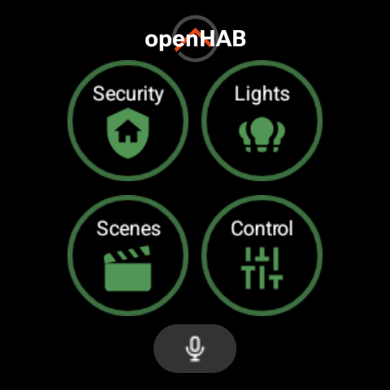
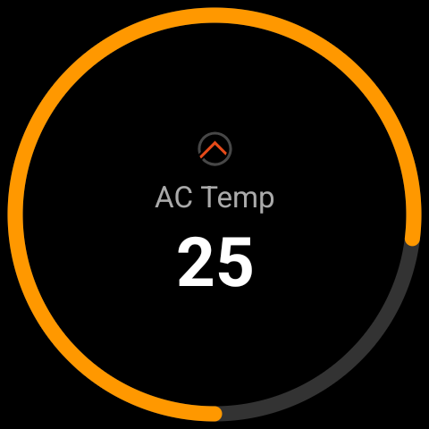
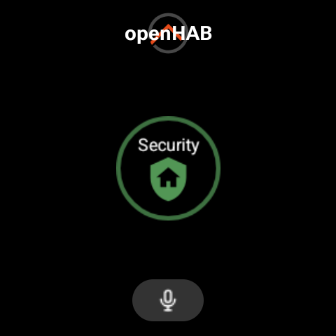
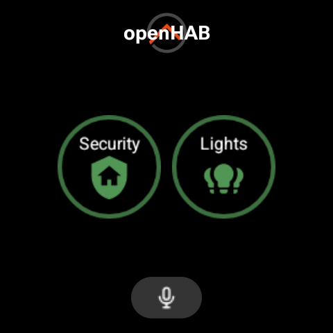
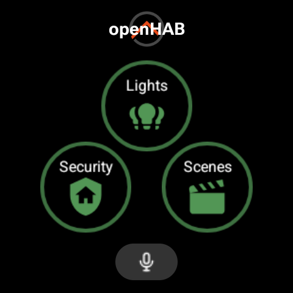
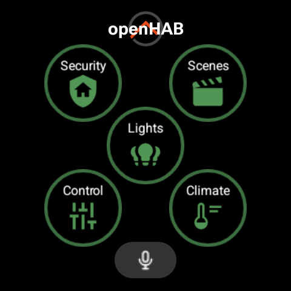
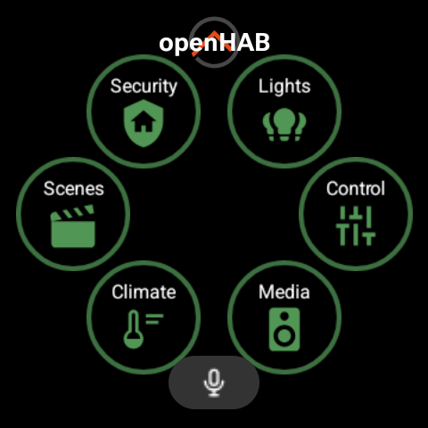
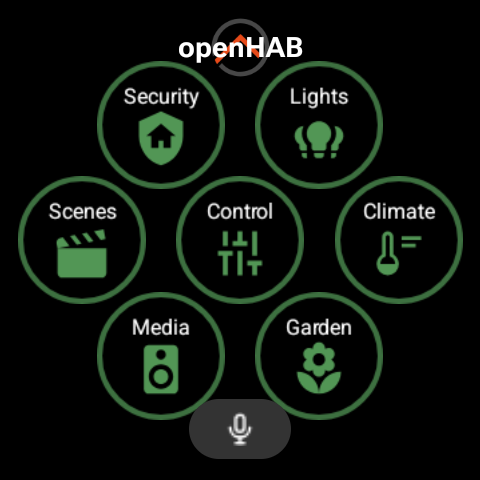
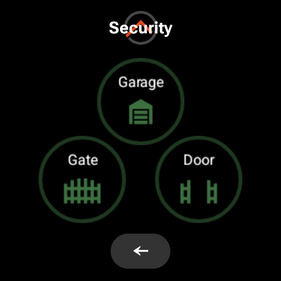
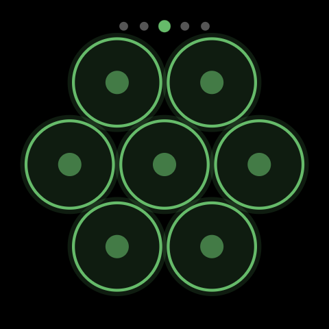

# Features

## 1. Wear OS Tile

The primary interface — a system-level tile accessible by swiping from the watch face.



### What it does

Displays 1-7 openHAB items as tappable buttons in a concentric layout. Each button shows:
- Item icon (from openHAB icon set, configurable via metadata)
- Item label (truncated to 8 characters)
- Current state — rendered as text or color highlight (configurable via `valueDisplay`)
- Themed ring with radial glow (amber/blue/green/purple/red)

### Interaction Model

Items behave differently based on their type and metadata configuration:

| Item Type | Tile Display | Tap Action |
|-----------|-------------|------------|
| Switch | Label + state (ON/OFF or color) | Send toggle command, wait for SSE state update |
| Dimmer/Number (with min/max) | Label + current value | Opens dedicated rotary control screen |
| Color | Label + state (HSB or color) | Opens color picker (preset chips + bezel brightness) |
| Rollershutter | Label + position % | Opens roller shutter control (UP/STOP/DOWN + bezel) |
| Item with commandOptions | Label + current value | Opens choice picker (scrollable option list) |
| Contact (read-only) | Label + value | No action (display only) |
| Command button (`action: "command"`) | Label + state from `valueItem` or primary | Sends fixed `commandValue` to target item |
| Navigation button (`action: "page:..."`) | Page label + icon | Navigate to sub-page (via LoadAction) |

#### Switch items (toggle)

Tapping a switch item sends the command to the server. The button updates when the SSE event confirms the new state — no optimistic updates, always accurate.

If `needsConfirmation: true` is set in metadata, a confirmation dialog appears before sending.

#### Command items (fixed command)

When `action: "command"` is set, tapping always sends the fixed `commandValue` string to the target item (`commandItem` or primary item). No toggle logic — the same command is sent regardless of state.

Display state can come from a separate `valueItem` (e.g., a Contact sensor), with optional `invertValue` to flip the active/inactive color interpretation. This enables patterns like gate buttons (tap sends pulse, display shows sensor feedback).

#### Range/Dimmer items (rotary control)

Tapping a range item navigates to a dedicated control screen:



- Current value displayed large in the center
- Bezel (rotating crown) changes the value up/down
- Min/max/step auto-detected from `stateDescription`
- Value sent via debounced command (500ms after last rotation)
- Back gesture or swipe-dismiss returns to the tile

#### Color items (color picker)

Tapping a Color item opens a dedicated color selection screen:

- **Preset color chips** in a 2×5 grid: Red, Orange, Yellow, Green, Cyan, Blue, Purple, Pink, Warm White, Cool White
- **Brightness arc** on the screen edge shows current brightness level
- **Bezel rotation** adjusts brightness (0-100%)
- Tap a chip to select hue + saturation (brightness preserved)
- Tap ON/OFF label to toggle the light
- Sends openHAB HSB command format (e.g. `120,100,50`) with 400ms debounce
- Parses current state from item's HSB string on launch (supports `H,S,B`, percentage, ON/OFF)

#### Rollershutter items (shutter control)

Tapping a Rollershutter item opens a dedicated control screen:

- Three large vertically-stacked buttons: **UP** (green), **STOP** (orange), **DOWN** (red)
- Current position displayed in the center: `OPEN` (0%), `CLOSED` (100%), or percentage
- **Position arc** on screen edge starts from top, fills clockwise as shutter closes
- **Bezel rotation** adjusts position directly (sends percentage command with 500ms debounce)
- UP/DOWN/STOP send their respective commands immediately
- Position refreshes from server 500ms after STOP command

#### Items with command options (choice picker)

Items that have `commandDescription.commandOptions` (or `stateDescription.options` as fallback) open a scrollable list:

- **ScalingLazyColumn** (Wear OS optimized for round screens)
- Header shows item label
- Each option displayed as a card with label and raw command value
- Currently active option highlighted in amber
- Tap sends the command immediately
- Useful for scene selectors, input selectors, mode switches, and any item with predefined values

### Concentric Layout

Buttons are sized per layout — larger when fewer items allow it:

| Count | Button size | Arrangement | Notes |
|-------|-------------|-------------|-------|
| 1 | 74dp | Screen center | Single large button |
| 2 | 74dp | Horizontal center line, 4dp gap | Centered pair |
| 3 | 74dp | Staggered: center up, sides down (0.42× shift) | Chevron/roof shape, ~4dp diagonal gap |
| 4 | 74dp | 2×2 square grid, 4dp gap, shifted 4dp up | Clears mic button zone |
| 5 | 64dp | Diamond + center (edge_ratio=1.0) | — |
| 6 | 64dp | 7-item layout minus center button | Honeycomb |
| 7 | 64dp | Full: 2 top + 3 middle + 2 bottom | Full honeycomb |

| 1 | 2 | 3 | 4 |
|---|---|---|---|
|  |  |  |  |

| 5 | 6 | 7 |
|---|---|---|
|  |  |  |

The layout 3 stagger places side buttons at `centerY + 0.42*btn` and the center button at `centerY - 0.42*btn`, creating diagonal separation that allows larger buttons without horizontal overlap.

Fixed zones (overlays, don't affect button positions):
- Top: "openHAB" title (main page) or page name (sub-pages) — dims during loading
- Bottom: Mic button (main page, drawn SVG icon) or Back button (sub-pages, ← character)

### Tile State Machine

| State | Visual | Clickable | Trigger |
|-------|--------|-----------|---------|
| Dimmed | All buttons grey, rings faded, title grey | No | Swipe to tile (initial render) |
| Live | Colored rings, themed icons, title white | Yes | Fresh states received from server |

Flow:
1. Swipe to tile → render dimmed from cached config
2. Fetch fresh states from server in background
3. States arrive → re-render lit → SSE connection starts
4. SSE event received → fetch fresh states from server → re-render with updated state
5. Swipe away → SSE stops
6. Page navigation (main ↔ sub-pages) → instant from cache, stays lit

### Page Navigation



- **Forward**: Tap navigation button → `LoadAction` (instant, no Activity launch)
- **Back**: Tap back button at bottom → `LoadAction` returns to main
- **With confirmation**: Launches `PageNavigationActivity` for dialog
- **Nav button state**: Active (accent color) if any item on its target sub-page is active. Priority: explicit `valueItem` > own item state > aggregate from sub-page items.
- Max depth: 2 levels (main + sub-pages)
- Sub-page items use cached states (no re-fetch)

### Themes



5 color themes available (configurable via long-press → pencil on tile):
- **Amber** — warm golden glow (default)
- **Blue** — cool tech glow
- **Green** — nature/secure glow
- **Purple** — elegant accent
- **Red** — intense warm glow

Theme controls: ring color, icon tint, radial glow, state text color.
Theme selection stored locally in DataStore.
Theme picker uses bezel/crown rotation with live preview.

### Caching

- **Tile config**: persisted to disk as JSON (`TileConfigDiskCache`). On process restart, renders immediately from disk cache (warm start), then refreshes states from server in background.
- **Item states**: fetched fresh on each tile enter (cold load = 2 API calls, hot path = 1 batch call). Updated via SSE while visible.
- **Group item state**: when a Group's own state is NULL/UNDEF, derives activity from its members.
- **Icon bytes**: LRU memory cache (30 entries). Survives tile refreshes.
- **Composited bitmaps**: regenerated each render (theme/state dependent).
- **SSE reconnection**: coroutine-based loop with 30s ALIVE timeout, 5s reconnect delay, 3-strike polling fallback (15s interval).

### Configuration

Items can be configured in two ways:

1. **Phone Companion App** (recommended) — Visual tile editor writes `wear:tile-page` UI components to the server via REST API. No item metadata knowledge required.
2. **openHAB item metadata** (legacy) — Set `wearTile` metadata namespace on items directly in the openHAB Main UI. The watch reads this configuration — it never modifies server-side metadata.

The phone companion approach stores config as UI components at `/rest/ui/components/wear:tile`, supporting per-slot configuration including stateDisplay, action, actionItem, stateItem, and more.

See [openHAB Configuration](openhab-configuration.md) for metadata setup instructions.

### State Display Modes

Each tile button's state indicator can be configured with one of three modes:

| Mode | API Value | Visual | Use Case |
|------|-----------|--------|----------|
| **Color** | `"color"` | Icon ring colored (amber=active, grey=inactive), no text | Binary on/off indicators |
| **Value** | `"value"` | Neutral icon ring + state text below (ON/OFF, 22.5°C, 50%) | Showing current values |
| **None** | `"none"` | Neutral icon ring, no text, no active/inactive indication | Command-only buttons (gates, scenes) |

### Implementation

| Component | File | Role |
|-----------|------|------|
| `OpenHabTileService` | `tile/OpenHabTileService.kt` | Fetches items, computes positions, builds tile layout |
| `TileActionReceiver` | `tile/TileActionReceiver.kt` | Handles tap → sends command → requests refresh |
| `PageNavigationActivity` | `tile/PageNavigationActivity.kt` | Handles confirmed page navigation |
| `ThemePickerActivity` | `ui/tile/ThemePickerActivity.kt` | Theme color selector (bezel rotation) |
| `ItemCache` | `data/repository/ItemCache.kt` | In-memory cache for tile items + states |
| `TileStateEventSource` | `data/api/TileStateEventSource.kt` | SSE client for real-time state updates |
| `IconCompositor` | `data/icon/IconCompositor.kt` | Renders icons with ring, glow, tint, label |

---

## 2. Voice Commands

Triggered from the mic button on the tile's main page.


### How it works

1. Tap mic button → `VoiceCommandActivity` launches
2. System speech recognizer launches immediately
3. Recognized text is sent to `POST /rest/voice/interpreters` with device locale
4. openHAB's interpreter processes the command
5. Watch shows success/error feedback, then finishes

### Server-side requirements

The voice endpoint requires a Human Language Interpreter (HLI) configured in openHAB:

1. **Set locale** in `conf/services/runtime.cfg`:
   ```
   org.openhab.i18n:language=en
   org.openhab.i18n:region=US
   ```

2. **Set default HLI** in `conf/services/runtime.cfg`:
   ```
   org.openhab.voice:defaultHLI=system
   ```

Available interpreters:
- `system` — Built-in, matches item labels directly. Supports "turn on [label]". Limited pattern set.
- `rulehli` — Rule-based, uses semantic model (requires Location tags on room groups). More capable but needs proper semantic tagging.

### Notes

- No configuration needed on the watch — uses server credentials from setup
- Language comes from the watch's system locale
- Requires network connectivity (speech recognition is cloud-based)
- No separate menu entry — accessed only from tile mic button
- The `system` interpreter matches against item labels — items need descriptive English labels

---

## 3. App Menu (Launcher)

Opening the app from the watch launcher shows:

1. **Server Settings** — configure server URL, username, password (RemoteInput)
2. **Reload Items** — clears item cache, fetches fresh config from server, shows toast with result

### Setup

- First launch auto-redirects to setup if not configured
- Server URL pre-filled with `https://myopenhab.org`
- Text input via Wear OS RemoteInput (keyboard/voice/handwriting)
- Verifies connectivity after save ("Save & Connect")
- Existing credentials loaded when re-opening settings

---

## 4. Theme Picker (Tile Long-Press)

Accessed via long-press on tile → system pencil icon.

- Shows concentric button layout as live preview
- Rotate bezel/crown to cycle themes (amber → blue → green → purple → red)
- Dot indicators at top edge show position
- All buttons update color in real-time
- Theme saved automatically on rotation
- Swipe back to confirm and exit

---

## Architecture Decisions

| Decision | Rationale |
|----------|-----------|
| Server is source of truth for tile config | No sync conflicts, phone app is the visual editor |
| Watch stores only theme + credentials locally | Minimal local state, no divergence from server |
| Concentric layout from screen size | Responsive to all Wear OS screen sizes |
| Box overlay positioning (absolute) | ProtoLayout doesn't support relative/grid positioning |
| Dim/lit state machine | Clear online indicator, prevents commands before state is known |
| SSE for real-time updates | Battery-efficient push-based, only while tile visible |
| LoadAction for page navigation | Instant re-render without Activity launch overhead |
| Disk cache with hot path refresh | Fast warm start, then 1 API call to refresh states |
| Dedicated control activities per item type | Best UX for each interaction pattern (bezel, buttons, list) |
| Phone companion edits UI components (not metadata) | Richer config (action, stateItem, etc.) beyond what metadata supports |
| Config version counter for sync detection | Simple integer compare, no timestamp drift issues |

---

## 5. Phone Companion App

A full Android phone application for managing the watch tile configuration.

### Connection Setup

Two server connections:
- **Main Server** — the openHAB server URL used by the watch (cloud relay or direct)
- **Config Server** — local network URL for REST API access to edit tile configuration

Authentication modes for Config Server:
- **Basic Auth** — username/password (requires `allowBasicAuth=true` in openHAB API Security settings)
- **API Token** — Bearer token generated in openHAB Settings > API Security (recommended for openHAB 5+)

Both connections are tested before saving. Credentials are stored in EncryptedSharedPreferences.

### Tile Design Editor

Visual editor for the watch tile layout:
- **Page tabs** at the top for switching between tile pages
- **Page rename** — long-press a tab to rename the page (label only, uid stays stable)
- **Layout selector** to set the button count (1-7)
- **Circular watch preview** rendering the actual tile layout
- **Slot configuration** — tap any slot to open the config sheet:
  - Item selection (searchable picker)
  - Icon override (searchable bottom sheet: MDI, Material Symbols, openHAB icons)
  - Label override
  - State display mode (Color / Value / None)
  - Action type (Toggle / Command / Navigate)
  - Fixed command, action item, state item, invert state, confirmation, aggregate

### Complication Editor

Configure watch face complications:
- List view of all configured complications with add/edit/remove
- 4 supported types: SHORT_TEXT, LONG_TEXT, RANGED_VALUE, MONOCHROMATIC_IMAGE
- Per-type expandable config sections with live pattern validation
- Character limits enforced (7 chars for short text fields)
- Import existing complication config from item metadata

### Theme Sync

- Select a theme color on the phone
- Push to watch on "Sync to Watch" tap
- Watch applies immediately (refreshes tile + saves to DataStore)
- Phone reads current watch theme from DataClient when editor opens

### Config Sync Detection

- Watch writes its current `configVersion` to DataClient after each cold load
- Phone reads this + fetches the server's version, compares
- "Watch config out of sync" banner on home screen when they differ
- Clears on sync, re-checks on app resume
